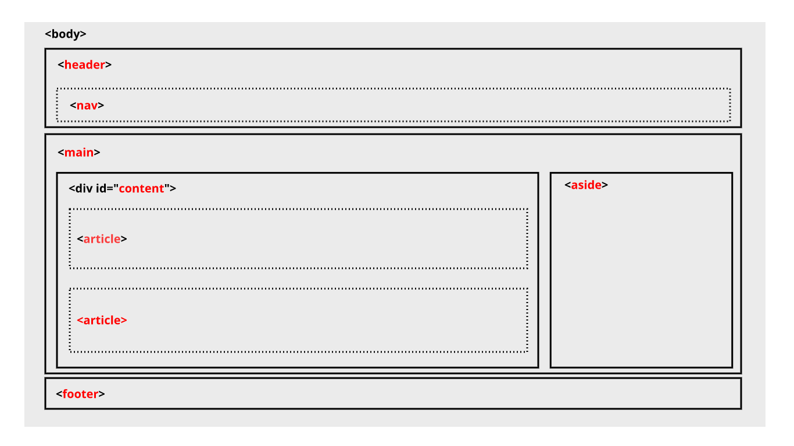

# Submission Proyek Halaman Website

Selamat, akhirnya Anda telah sampai di penghujung pembelajaran. Anda telah mempelajari
- dasar HTML (dapat dipelajari mulai dari modul [Pengenalan ke HTML](https://www.dicoding.com/academies/123/tutorials/4113 "Pengenalan ke HTML")),
- penerapan elemen *semantic* (dapat dipelajari mulai dari modul [Semantic HTML - Mengorganisasikan Halaman Konten](https://www.dicoding.com/academies/123/tutorials/4150 "Semantic HTML - Mengorganisasikan Halaman Konten")),
- menerapkan *styling* menggunakan CSS (dapat dipelajari mulai dari modul [Pengenalan ke Styling](https://www.dicoding.com/academies/123/tutorials/4180 "Pengenalan ke Styling")); dan
- *layouting* menggunakan float ataupun flexbox (dapat dipelajari mulai dari modul [Floating](https://www.dicoding.com/academies/123/tutorials/5906 "Floating")).

Anda juga sudah mengerjakan semua latihan yang diberikan pada kelas ini.

Untuk bisa lulus dan mendapatkan sertifikat dari akademi ini, **Anda harus mengerjakan tugas Halaman Website sesuai kriteria lengkap di bawah**. Tim reviewer akan memeriksa pekerjaan Anda dan memberikan *review* pada proyek yang Anda buat.

# Kriteria Submission

Berikut kriteria submission yang harus Anda penuhi:
- Terdapat elemen \<header>, \<footer>, \<main>, \<article>, dan \<aside> di berkas HTML.
- Masing-masing elemen wajib berisi konten yang peruntukkannya sesuai dengan elemen tersebut (menerapkan konsep *semantic HTML* dalam menyusun struktur website).  
  Sebagai contoh:  Header berisi judul dan navigation. Sedangkan konten artikel tidak boleh berada pada Header.	
- Wajib menampilkan identitas diri (biodata diri) yang minimal harus berisi foto asli diri dan nama sesuai profil Dicoding. Identitas diri wajib ditampilkan dalam elemen \<aside>.
- Menyusun layout dengan menggunakan float atau flexbox.
- Tema yang ditampilkan bebas, **kecuali** tema Bandung.
- Semakin detail dan lengkap website Anda maka nilai submission bisa lebih tinggi.

Berikut sketsa dari struktur website yang bisa dijadikan referensi untuk mengerjakan submission, namun tidak diwajibkan asalkan memenuhi kriteria submission:

> **Tips**
> 1. Ketika melakukan *import* suatu resource pada file HTML, pastikan untuk menggunakan **relative path**, dan hindari menggunakan **absolute path** karena berpotensi menyebabkan resource tersebut tidak dapat dibaca ketika dilakukan reviu. Berikut adalah contohnya :  
**Absolute path** : C:\Users\Documents\Projects\styles\style.css **atau** /home/user/Projects/styles/style.css  
**Relative path** : styles/style.css
> 2. Masih dalam topik yang sama mengenai asset/resource, pastikan dalam penulisan nama file atau folder **sama persis** dengan keadaan sebenarnya. Misalnya pada folder proyek, ada gambar dengan nama **profile.jpg**, maka harus di import juga dengan nama **profile.jpg** (bukan **Profile.jpg**). Hal ini bertujuan agar beberapa file tersebut bisa dimuat dengan baik oleh browser pada beberapa Sistem Operasi, seperti Linux.
> 3. Agar memudahkan Anda dalam membuat submission, gunakanlah IDE (Integrated Development Environtment) yang mendukung produktivitas dalam menuliskan kode. Misalnya **Atom, VSCode,** atau yang lainnya.

# Saran Submission
Submission Anda akan dinilai oleh reviewe dengan **sakala 1-5** berdasarkan dari parameter yang ada.

Anda dapat menerapkan beberapa **saran** untuk mendapatkan nilai tinggi, berikut sarannya:
- Menerapkan tampilan aplikasi yang menarik:
  - Memiliki pemilihan warna yang pas dengan tema aplikasi (Dalam memilih warna, Anda dapat memanfaatkan tools pemilihan warna seperti [colorhunt.co](https://colorhunt.co/ "colorhunt.co")).
  - Tata letak elemen yang pas.  
    Contoh : Tidak ada konten yang bertumpuk
  - Penggunaan font yang pas dengan tema.
  - Penerapan padding dan margin yang pas.
- Menerapkan layout yang responsif
  - Menggunakan *media query* untuk menyesuaikan layout pada berbagi ukuran layar device.  
    Pastikan untuk tidak terdapat konten yang menumpuk maupun keluar dari kontainer ketika dicoba pada desktop, tablet, dan juga mobile.
  - Menerapkan flexbox dalam menyusun layout.
- Terdapat penerapan JavaScript dalam memanipulasi DOM, seperti: (*pilih satu*)
  - Membuat drop down.
  - Memanfaatkan logika seperti looping dalam menampilkan elemen dan konten.
  - Membuat slider.
  - dan lainnya yang mendukung tampilan website agar lebih hidup.

Detail penilaian submission:
- **Bintang 1** : Semua ketentuan terpenuhi, namun terdapat indikasi plagiat yaitu dengan menggunakan proyek orang lain dan hanya mengubah kontennya saja.
- **Bintang 2** : Semua ketentuan terpenuhi, namun terdapat kekurangan pada tampilan website. Seperti tidak menerapkan responsibilitas, kombinasi warna tidak tepat, dsb.
- **Bintang 3** : Semua ketentuan terpenuhi, namun hanya mengikuti apa yang ada pada modul.
- **Bintang 4** : Semua ketentuan terpenuhi dan menerapkan *minimal salah satu* saran di atas.
- **Bintang 5** : Semua ketentuan terpenuhi dan menerapkan *semua* saran di atas.

> **Catatan:**
> 1. Jika *submission Anda ditolak* maka *tidak ada penilaian*. Kriteria penilaian bintang di atas hanya berlaku *jika submission Anda lulus*.
> 2. Jika submission Anda terdapat penerapan JavaScript, maka **tuliskan feature yang dibuat** dengan javascript dan **jelaskan cara mengakses** feature tersebut pada **Student Notes.**

# Submission yang Tidak Sesuai Kriteria
Jika submission Anda tidak sesuai dengan kriteria, maka akan ditolak oleh reviewer, berikut poin-poinnya:

- *Tidak memenuhi* kriteria yang sudah ditentukan.
- Menggunakan library Bootstrap, Materialize, Foundation, ataupun library lain yang semacamnya untuk menyusun layout.
- Menggunakan *template* project yang didapat *selain* dari latihan Dicoding.
- Menggunakan tema mengenai Kota Bandung, maupun mengirimkan ulang beberapa project yang dipelajari pada modul latihan
- Informasi yang ditampilkan tidak relevan. Salah satu contohnya adalah menggunakan text placeholder seperti *lorem ipsum* sebagai konten dari web yang dibuat.

Gambaran Submission
1. Contoh submission dengan nilai yang baik.  
   
2. Contoh submission dengan kriteria minimal.  
   

# Forum Diskusi
Jika mengalami kesulitan, Anda bisa menanyakan langsung ke forum diskusi. [https://www.dicoding.com/academies/123/discussions](https://www.dicoding.com/academies/123/discussions "https://www.dicoding.com/academies/123/discussions").

# Ketentuan Berkas Submission
Beberapa poin yang perlu diperhatikan ketika mengirimkan berkas submission:

- Mengirimkan proyek Submission dalam bentuk **folder Proyek**, yang **diarsipkan dalam format ZIP**.
- Di dalam folder proyek tersebut **terdiri dari HTML, CSS, JS**, dan **aset** yang digunakan dalam halaman web yang Anda buat. ***Jika tidak lengkap maka proyek Submission akan ditolak.***

# Ketentuan Proses Review
Beberapa hal yang perlu Anda ketahui mengenai proses review:

- Tim reviewer akan mengulas submission Anda dalam waktu **selambatnya 3 (tiga) hari kerja** (*tidak termasuk Sabtu, Minggu,* dan *hari libur nasional*).
- Tidak disarankan untuk melakukan *submit berkali-kali* karena akan memperlama proses penilaian.
- Anda akan mendapatkan notifikasi hasil review submission via email. Status submission juga bisa dilihat dengan mengecek di halaman [submission](https://www.dicoding.com/academysubmissions/my "submission").

# Video Pengiriman Submission
Simak cara untuk mengirimkan proyek submission pada video ini:  

# Perhatian!

Sesuai dengan [terms of use](https://www.dicoding.com/termsofuse "term of use") di Dicoding, submission kelas Dicoding Academy **haruslah hasil karya Anda sendiri.**

Kode yang didapatkan dari sumber lain (website, buku, forum, GitHub, dan lain-lain) hanya digunakan sebagai referensi. Tingkat kesamaannya **tidak boleh lebih dari 70%.**

Kami memiliki hak mutlak untuk mengenakan **sanksi** kepada peserta **plagiat** yang melanggar ketentuan di atas. Sanksi tersebut berupa **penangguhan akun Dicoding**. Artinya Anda tidak dapat melakukan submission apapun di kelas Dicoding Academy selama masa penangguhan. Progress belajar peserta kelas Dicoding Academy pun, otomatis kami reset ke 0 (nol), tanpa terkecuali.
