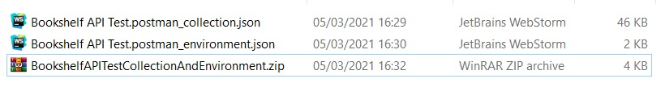
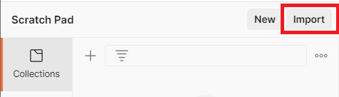
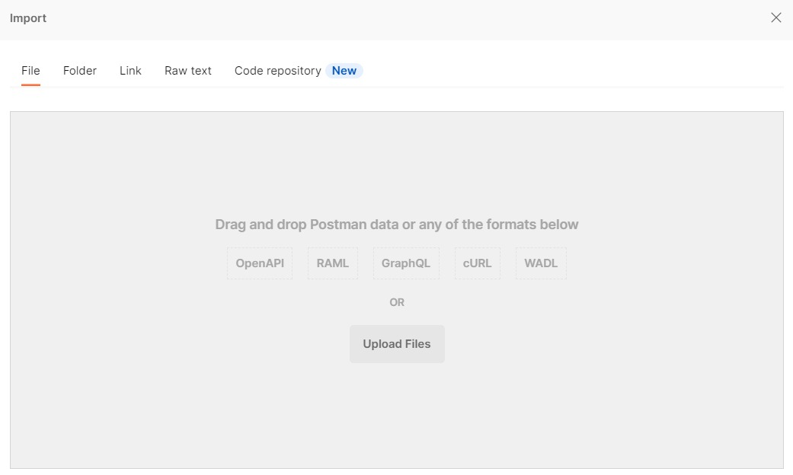
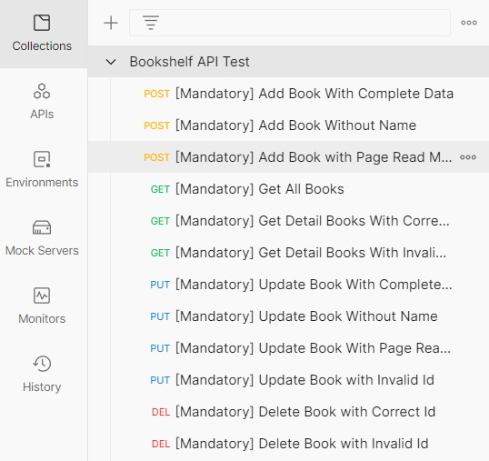
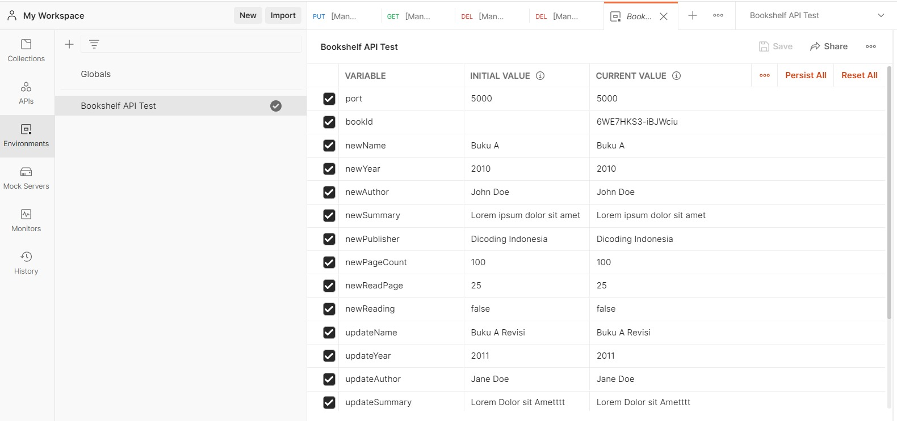

# Submission Bookshelf API


## Pengantar
Selamat! Akhirnya Anda telah sampai di penghujung pembelajaran. Anda telah mempelajari:
- Istilah *back-end*, *front-end*, *server*, *client*, *web service*, REST API serta belajar cara berkomunikasi antara *client* dengan *server* menggunakan cURL.
- Dasar-dasar Node.js dalam pengembangan Back-End seperti *global object*, *process*, *modularization*, *event*, dan yang lainnya.
- Membangun *web server* menggunakan Node.js *native* maupun Hapi Framework. Selain itu, Anda sudah membuat RESTful API sederhana yang mendukung fungsionalitas aplikasi catatan.
- Melakukan *deploy* RESTful API pada Amazon EC2.
- Pengujian RESTful API secara otomatis menggunakan Postman.

Tentu Anda juga sudah mengerjakan seluruh latihan yang diberikan pada kelas ini.

Untuk bisa lulus dan mendapatkan sertifikat dari akademi ini, Anda harus mengerjakan tugas yakni membuat proyek **Bookshelf API** sesuai kriteria lengkap di bawah ini. Tim Reviewer akan memeriksa pekerjaan Anda dan memberikan reviu pada proyek yang Anda buat.


## Kriteria
Terdapat 5 kriteria utama yang harus Anda penuhi dalam membuat proyek Bookshelf API.

### Kriteria 1 : API dapat menyimpan buku
API yang Anda buat harus dapat menyimpan buku melalui *route*:
- Method : **POST**
- URL : **/books**
- Body Request:
  ```Javascript
  {
      "name": string,
      "year": number,
      "author": string,
      "summary": string,
      "publisher": string,
      "pageCount": number,
      "readPage": number,
      "reading": boolean
  }

Objek buku yang disimpan pada *server* harus memiliki struktur seperti contoh di bawah ini:
```Javascript
{
    "id": "Qbax5Oy7L8WKf74l",
    "name": "Buku A",
    "year": 2010,
    "author": "John Doe",
    "summary": "Lorem ipsum dolor sit amet",
    "publisher": "Dicoding Indonesia",
    "pageCount": 100,
    "readPage": 25,
    "finished": false,
    "reading": false,
    "insertedAt": "2021-03-04T09:11:44.598Z",
    "updatedAt": "2021-03-04T09:11:44.598Z"
}
```
Properti yang ditebalkan diolah dan didapatkan di sisi *server*. Berikut penjelasannya:
- `id` : nilai `id` haruslah unik. Untuk membuat nilai unik, Anda bisa memanfaatkan [nanoid](https://www.npmjs.com/package/nanoid "nanoid").
- `finished` : merupakan properti boolean yang menjelaskan apakah buku telah selesai dibaca atau belum. Nilai `finished` didapatkan dari observasi `pageCount === readPage`.
- `insertedAt` : merupakan properti yang menampung tanggal dimasukkannya buku. Anda bisa gunakan `new Date().toISOString()` untuk menghasilkan nilainya.
- `updatedAt` : merupakan properti yang menampung tanggal diperbarui buku. Ketika buku baru dimasukkan, berikan nilai properti ini sama dengan `insertedAt`.

Server harus merespons **gagal** bila:
- Client tidak melampirkan properti `name` pada *request body*. Bila hal ini terjadi, maka *server* akan merespons dengan:
  - Status Code : **400**
  - Response Body:
    ```Javascript
    {
        "status": "fail",
        "message": "Gagal menambahkan buku. Mohon isi nama buku"
    }
    
- Client melampirkan nilai properti `readPage` yang lebih besar dari nilai properti `pageCount`. Bila hal ini terjadi, maka *server* akan merespons dengan:
  - Status Code : **400**
  - Response Body:
    ```Javascript
    {
        "status": "fail",
        "message": "Gagal menambahkan buku. readPage tidak boleh lebih besar dari pageCount"
    }
    
- Server gagal memasukkan buku karena alasan umum (*generic error*). Bila hal ini terjadi, maka *server* akan merespons dengan:
  - Status Code : **500**
  - Response Body:
    ```Javascript
    {
        "status": "error",
        "message": "Buku gagal ditambahkan"
    }
    
Bila buku **berhasil** dimasukkan, *server* harus mengembalikan respons dengan:
- Status Code : **201**
- Response Body:
  ```Javascript
  {
      "status": "success",
      "message": "Buku berhasil ditambahkan",
      "data": {
          "bookId": "1L7ZtDUFeGs7VlEt"
      }
  }


### Kriteria 2 : API dapat menampilkan seluruh buku
API yang Anda buat harus dapat menampilkan seluruh buku yang disimpan melalui *route*:
- Method : **GET**
- URL: **/books**

Server harus mengembalikan respons dengan:
- Status Code : **200**
- Response Body:
  ```Javascript
  {
      "status": "success",
      "data": {
          "books": [
              {
                  "id": "Qbax5Oy7L8WKf74l",
                  "name": "Buku A",
                  "publisher": "Dicoding Indonesia"
              },
              {
                  "id": "1L7ZtDUFeGs7VlEt",
                  "name": "Buku B",
                  "publisher": "Dicoding Indonesia"
              },
              {
                  "id": "K8DZbfI-t3LrY7lD",
                  "name": "Buku C",
                  "publisher": "Dicoding Indonesia"
              }
          ]
      }
  }
  
Jika **belum** terdapat buku yang dimasukkan, *server* bisa merespons dengan *array* `books` kosong.
```Javascript
{
    "status": "success",
    "data": {
        "books": []
    }
}
```


### Kriteria 3 : API dapat menampilkan detail buku
API yang Anda buat harus dapat menampilkan seluruh buku yang disimpan melalui *route*:
- Method : **GET**
- URL: **/books/{bookId}**

Bila buku dengan `id` yang dilampirkan oleh *client* tidak ditemukan, maka *server* harus mengembalikan respons dengan:
- Status Code : **404**
- Response Body:
  ```Javascript
  {
      "status": "fail",
      "message": "Buku tidak ditemukan"
  }
  
Bila buku dengan `id` yang dilampirkan **ditemukan**, maka *server* harus mengembalikan respons dengan:
- Status Code : **200**
- Response Body:
  ```Javascript
  {
      "status": "success",
      "data": {
          "book": {
              "id": "aWZBUW3JN_VBE-9I",
              "name": "Buku A Revisi",
              "year": 2011,
              "author": "Jane Doe",
              "summary": "Lorem Dolor sit Amet",
              "publisher": "Dicoding",
              "pageCount": 200,
              "readPage": 26,
              "finished": false,
              "reading": false,
              "insertedAt": "2021-03-05T06:14:28.930Z",
              "updatedAt": "2021-03-05T06:14:30.718Z"
          }
      }
  }


### Kriteria 4 : API dapat mengubah data buku
API yang Anda buat harus dapat mengubah data buku berdasarkan `id` melalui *route*:
- Method : **PUT**
- URL : **/books/{bookId}**
- Body Request:
  ```Javascript
  {
      "name": string,
      "year": number,
      "author": string,
      "summary": string,
      "publisher": string,
      "pageCount": number,
      "readPage": number,
      "reading": boolean
  }
  
Server harus merespons **gagal** bila:
- Client tidak melampirkan properti `name` pada *request body*. Bila hal ini terjadi, maka *server* akan merespons dengan:
  - Status Code : **400**
  - Response Body:
    ```Javascript
    {
        "status": "fail",
        "message": "Gagal memperbarui buku. Mohon isi nama buku"
    }
    
- Client melampirkan nilai properti `readPage` yang lebih besar dari nilai properti `pageCount`. Bila hal ini terjadi, maka *server* akan merespons dengan:
  - Status Code : **400**
  - Response Body:
    ```Javascript
    {
        "status": "fail",
        "message": "Gagal memperbarui buku. readPage tidak boleh lebih besar dari pageCount"
    }
    
- `Id` yang dilampirkan oleh *client* tidak ditemukkan oleh *server*. Bila hal ini terjadi, maka *server* akan merespons dengan:
  - Status Code : **404**
  - Response Body:
    ```Javascript
    {
        "status": "fail",
        "message": "Gagal memperbarui buku. Id tidak ditemukan"
    }
    
Bila buku **berhasil diperbarui**, *server* harus mengembalikan respons dengan:
- Status Code : **200**
- Response Body:
  ```Javascript
  {
      "status": "success",
      "message": "Buku berhasil diperbarui"
  }


### Kriteria 5 : API dapat menghapus buku
API yang Anda buat harus dapat menghapus buku berdasarkan `id` melalui *route* berikut:
- Method : **DELETE**
- URL: /books/{bookId}

Bila `id` yang dilampirkan tidak dimiliki oleh buku manapun, maka *server* harus mengembalikan respons berikut:
- Status Code : **404**
- Response Body:
  ```Javascript
  {
      "status": "fail",
      "message": "Buku gagal dihapus. Id tidak ditemukan"
  }
  
Bila `id` dimiliki oleh salah satu buku, maka buku tersebut harus dihapus dan *server* mengembalikan respons berikut:
- Status Code : **200**
- Response Body:
  ```Javascript
  {
      "status": "success",
      "message": "Buku berhasil dihapus"
  }


## Pengujian
Ketika membangun Bookshelf API, tentu Anda perlu menguji untuk memastikan API berjalan sesuai dengan kriteria yang ada. Kami sudah menyediakan berkas Postman Collection dan Environment yang dapat Anda gunakan untuk pengujian. Silakan unduh berkasnya pada tautan berikut:

- [Postman Bookshelf API Test Collection dan Environment](https://github.com/dicodingacademy/a261-backend-pemula-labs/raw/099-shared-files/BookshelfAPITestCollectionAndEnvironment.zip "Postman Bookshelf API Test Collection dan Environment")

Anda perlu meng-*import* kedua berkas tersebut pada Postman untuk menggunakannya. Caranya, ekstrak berkas yang sudah diunduh hingga menghasilkan dua berkas file JSON.



Kemudian pada aplikasi Postman, klik tombol **import** yang berada di atas panel kiri aplikasi Postman.



Kemudian klik tombol **Upload Files** untuk meng-*import* kedua berkas JSON hasil ekstraksi.



Setelah itu, Bookshelf API Test Collection dan Environment akan tersedia pada Postman Anda.

Collection  
  
Environment  



## Saran
Submission Anda akan dinilai oleh Reviewer guna menentukkan kelulusan Anda. Untuk lulus dari kelas ini, proyek Bookshelf API harus memenuhi seluruh pengujian otomatis pada Postman *request* yang bertanda **[Mandatory]**. Bila salah satu pengujiannya gagal, maka proyek Anda akan kami tolak.

Submission Anda akan dinilai oleh Reviewer dengan **skala 1-5**. Untuk mendapatkan nilai tinggi, silakan penuhi pengujian otomatis pada *request* yang bertanda **[Optional]**. Berikut detail dari fitur atau persyaratan opsional dari submission ini:

- Tambahkan fitur *query parameters* pada *route* **GET /books** (Mendapatkan seluruh buku).
  - `?name` : Tampilkan seluruh buku yang mengandung nama berdasarkan nilai yang diberikan pada *query* ini. Contoh /books?name=”dicoding”, maka akan menampilkan daftar buku yang mengandung nama “dicoding” secara ***non-case sensitive*** (tidak peduli besar dan kecil huruf).
  - `?reading` : Bernilai 0 atau 1. Bila 0, maka tampilkan buku yang sedang tidak dibaca (reading: false). Bila 1, maka tampilkan buku yang sedang dibaca (reading: true). Selain itu, tampilkan buku baik sedang dibaca atau tidak.
  - `?finished` : Bernilai 0 atau 1. Bila 0, maka tampilkan buku yang sudah belum selesai dibaca (finished: false). Bila 1, maka tampilkan buku yang sudah selesai dibaca (finished: true). Selain itu, tampilkan buku baik yang sudah selesai atau belum dibaca.
- Menerapkan **CORS** pada seluruh *resource* yang ada.
- Menggunakan ESLint dan salah satu *style guide* agar gaya penulisan kode JavaScript lebih konsisten.

Berikut adalah detail penilaian submission:

- **Bintang 1** : Semua ketentuan wajib terpenuhi, namun terdapat indikasi kecurangan dalam mengerjakan submission.
- **Bintang 2** : Semua ketentuan wajib terpenuhi, namun terdapat kekurangan pada penulisan kode. Seperti tidak menerapkan *modularization* atau gaya penulisan tidak konsisten.
- **Bintang 3** : Semua ketentuan wajib terpenuhi, namun tidak terdapat improvisasi atau persyaratan opsional yang dipenuhi.
- **Bintang 4** : Semua ketentuan wajib terpenuhi dan menerapkan minimal satu persyaratan opsional.
- **Bintang 5** : Semua ketentuan wajib terpenuhi dan menerapkan seluruh persyaratan opsional yang ada.

> Catatan:  
> Jika *submission Anda ditolak* maka *tidak ada penilaian*. Kriteria penilaian bintang di atas hanya berlaku *jika submission Anda lulus*.


## Lainnya


### Ketentuan Berkas Submission
- Berkas submission yang dikirim merupakan folder proyek dari Bookshelf API dalam bentuk **ZIP**. 
- Pastikan di dalam folder proyek yang Anda kirim terdapat berkas **package.json**.
- Pastikan Anda hapus dulu berkas **node_modules** pada folder proyek sebelum mengkompresi dalam bentuk **ZIP**.


### Submission Anda akan Ditolak bila
- Kriteria wajib Bookshelf API tidak terpenuhi.
- Ketentuan berkas submission tidak terpenuhi.
- Proyek yang Anda kirim tidak dapat dijalankan dengan baik (Reviewer menggunakan Node.js versi **LTS 14.17.0**).
- Menggunakan bahasa pemrograman dan teknologi lain, selain JavaScript dan Node.js.
- Menggunakan Framework Node.js **selain Hapi Framework**.
- Melakukan kecurangan seperti tindakan plagiasi.


### Ketentuan Proses Review
Beberapa hal yang perlu Anda ketahui mengenai proses review

- Tim penilai akan mengulas submission Anda dalam waktu **selambatnya 3 (tiga)** hari kerja (tidak termasuk Sabtu, Minggu, dan hari libur nasional).
- Tidak disarankan untuk melakukan *submit berkali-kali* karena akan memperlama proses penilaian.
- Anda akan mendapatkan notifikasi hasil review submission via email. Status submission juga bisa dilihat dengan mengecek di halaman [submission](https://www.dicoding.com/academysubmissions/my "submission").

### Perhatian!

Sesuai dengan [terms of use](https://www.dicoding.com/termsofuse "term of use") di Dicoding, submission kelas Dicoding Academy **haruslah hasil karya Anda sendiri.**

Kode yang didapatkan dari sumber lain (website, buku, forum, GitHub, dan lain-lain) hanya digunakan sebagai referensi. Tingkat kesamaannya **tidak boleh lebih dari 70%.**

Kami memiliki hak mutlak untuk mengenakan **sanksi** kepada peserta **plagiat** yang melanggar ketentuan di atas. Sanksi tersebut berupa **penangguhan akun Dicoding**. Artinya Anda tidak dapat melakukan submission apapun di kelas Dicoding Academy selama masa penangguhan. Progress belajar peserta kelas Dicoding Academy pun, otomatis kami reset ke 0 (nol), tanpa terkecuali.