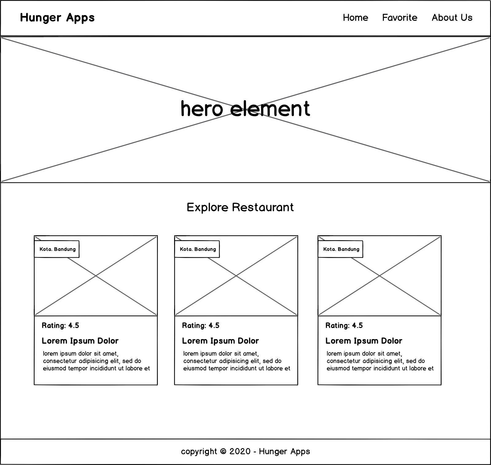

# Submission: Katalog Restoran
## Pengantar
Anda sudah mempelajari teknik mobile first approach, dan aksesibilitas pada web. Selama pembelajaran, Anda juga sudah berlatih:

- Menerapkan dasar responsibilitas tampilan pada perangkat seluler ([Implementing Small Things](https://www.dicoding.com/academies/219/tutorials/9175 "Implementing Small Things")).
- Menerapkan layout yang responsif menggunakan @media query dan grid css ([Implementing Responsive Layout](https://www.dicoding.com/academies/219/tutorials/9186 "Implementing Responsive Layout")).
- Optimisasi elemen UI seperti menerapkan navigation drawer, dan menetapkan jarak teks yang sesuai ([Other Optimization](https://www.dicoding.com/academies/219/tutorials/9196 "Other Optimization")).
- Menggunakan focus dan screen reader untuk menginput data di website ([Experiencing Focus](https://www.dicoding.com/academies/219/tutorials/9241 "Experiencing Focus") & [Experiencing Screen Reader](https://www.dicoding.com/academies/219/tutorials/9281 "Experiencing Screen Reader")).

Untuk mempelajari modul berikutnya, kirimkan proyek aplikasi web dengan tema **Katalog Restoran**. Aplikasi memiliki satu halaman statis yang menampilkan daftar restoran sesuai dengan data yang diberikan.

## Starter Project
Dalam mengerjakan proyek ini Anda harus menggunakan environment Webpack. Tenang, kami sudah menyiapkan starter project yang dapat Anda gunakan untuk mengerjakan submission pertama, hingga submission akhir. Jadi Anda tidak perlu repot melakukan konfigurasi, dsb.

- Silakan unduh starter [project submission](https://github.com/dicodingacademy/a219-mfwde-labs/raw/099-starter-project/restaurant-apps.zip "project submission"). 
- Buka proyek menggunakan code editor yang digunakan. 
- Jalankan npm install untuk memasang seluruh dependencies yang digunakan pada proyek.

Untuk menjalankan proyek, Anda bisa gunakan perintah:

- npm run start-dev : Menjalankan proyek pada mode development menggunakan webpack-dev-server.
- npm run build : Membangun proyek dalam mode production.

Tuliskan semua source code di dalam folder *src*. Kami sudah mengelompokan dalam folder-folder terpisah agar mudah mengatur aset-aset yang akan Anda buat.

- **src → public** : Digunakan untuk menyimpan aset yang dapat diakses secara public seperti favicon, icons, gambar, video, atau font.
- **src → styles** : Digunakan untuk menyimpan berkas styling seperti CSS.
- **src → scripts** : Digunakan untuk menyimpan berkas JavaScript, termasuk entry point.
- **src → templates** :  Digunakan untuk menyimpan aset HTML.

Struktur folder tidak harus seperti dicontohkan, Anda bisa mengubah sesuai dengan kebutuhan. Anda juga boleh melakukan kustomisasi konfigurasi webpack seperti menambahkan konfigurasi SASS, file-loader, ataupun lainnya.

> **Catatan:**  
> Anda juga akan menemukan berkas *karma.conf.js* serta folder specs dan berkas *sampleTestSpec.js* di dalamnya. Berkas-berkas tersebut adalah konfigurasi yang dibutuhkan untuk melakukan automate testing. Jika Anda belum mengetahui apa itu *automate testing*, hiraukan saja, namun jangan hapus berkas-berkas tersebut. Kita akan mempelajari automate testing pada modul mendatang.

## Kriteria
Fitur yang harus ada pada aplikasi: 

1. **App Bar (Navigation Bar)**  
  Syarat:
   - Menampilkan nama aplikasi atau brand logo dari aplikasi katalog restoran (tentukan sendiri nama aplikasi atau brand logonya).
   - Terdapat navigation menu:
     - Home → mengarah ke root domain.
     - Favorite → target URL cukup bernilai “#” (Sebagai placeholder untuk digunakan pada submission selanjutnya).
     - About Us → arahkan ke profil LinkedIn/Github/Social Media Anda, atau boleh juga ke personal web/blog.
   - Terdapat fitur navigation drawer yang berfungsi dengan baik bila diakses pada layar seluler.

2. **Hero Element (Jumbotron Element)**  
  Syarat:
   - Menampilkan hero element dengan gambar yang sudah ditentukan, silakan pilih salah satu aset yang disediakan di dalam starter proyek, *src → public → images → hero*. Gambar yang tidak digunakan, bisa Anda hapus.
   - Gambar hero element yang ditampilkan haruslah *full-width* atau memenuhi persyaratan sebagai berikut: 
     - Tampilkanlah minimal width 1000px pada  viewport width >= 1200px.
     - Jika ukuran viewport width < 1200px, maka hero element ditampilkan *full-width*.

3. **Daftar Restoran**  
 Syarat:
   - Menampilkan daftar restoran berdasarkan data yang sudah disediakan di dalam project starter (src → DATA.json), untuk menampilkannya boleh melalui cara hardcoded di berkas HTML, atau menggunakan DOM manipulation menggunakan JavaScript.
   - Wajib menampilkan nama, gambar dan minimal salah satu diantara kota, rating, dan atau deskripsi pada restoran.

4. **Footer** 
  Syarat:
   - Terdapat footer yang ditampilkan di bawah halaman.
   - Terdapat konten teks bebas sesuai dengan kreatifitas Anda. Misalnya, konten copyright yang mencangkup tahun dan nama aplikasi. Contoh: “Copyright © 2020 - Hunger Apps”.

5. **Responsibilitas Tampilan**  
  Syarat:
   - Tampilan web app harus responsif pada seluruh ukuran layar (mobile - tablet - desktop). *Utamakan tampilan mobile terlebih dahulu*.
   - Gunakan teknik Grid CSS atau Flexbox dalam menyusun layout. *Bila terdapat float, submission akan ditolak*.
   - Menetapkan ukuran viewport secara dinamis berdasarkan layar device yang digunakan.

6. **Aksesibilitas Website**
  Syarat:
   - Seluruh fungsionalitas website dapat dilakukan dengan menggunakan keyboard. Contohnya mengakses tombol hamburger button, mengakses tautan yang ada.
   - Menerapkan teknik *skip to content* untuk melewati focus pada menu navigasi.
   - Terdapat alternative teks pada seluruh gambar yang ditampilkan. Bila hanya gambar tidak memiliki arti apapun, cukup berikan atribut alt dengan nilai kosong. 
   - Dimensi *touch target* pada elemen yang diinteraksikan dengan *touch* harus memilliki ukuran minimal 44x44px. Adapun beberapa contoh elemen tersebut ialah *button, anchor, input text, dan textarea*.
     Pastikan juga terdapat jarak antar elemen tersebut supaya dimensi *touch target* tidak menumpuk.
   - Menggunakan *semantic element* dalam menyusun struktur dan landmarking HTML.

> **Perhatian:**  
> - Dalam mengerjakan submission ini, *Anda tidak diperkenankan* menggunakan css framework (seperti Bootstrap, Materialize, Tailwind, dll) yang dapat membantu dalam menyusun tampilan yang responsif. Tuliskan kode CSS from scratch, sistem layouting CSS murni saat ini sudah cukup powerful untuk membuat tampilan website responsif.
> - Semua materi dan starter project pada kelas ini masih menggunakan webpack v4. Jika ingin menambahkan dependensi baru kedalam project, maka pastikan dependensi tersebut support dengan webpack v4. Kamu bisa periksa terlebih dahulu changelog dari repository module yang akan diimport lalu install module tersebut sesuai dengan versinya, seperti ini : npm install [nama-module]@[versi]

Berikut kerangka tampilan yang bisa Anda gunakan sebagai referensi:  

## Saran
Submission Anda akan dinilai oleh reviewer dengan **skala 1-5** berdasarkan dari parameter yang ada.

Anda dapat menerapkan beberapa **saran** di bawah ini untuk mendapatkan nilai tinggi, berikut sarannya:
- Menerapkan tampilan aplikasi yang menarik:
  - Memiliki pemilihan warna yang pas dengan tema aplikasi (Dalam memilih warna, Anda dapat memanfaatkan tools pemilihan warna seperti [colorhunt.co](http://colorhunt.co/ "colorhunt.co")).
  - Tata letak elemen yang pas.
    Contoh: Tidak ada konten yang bertumpuk.
  - Penggunaan font yang pas dengan tema.
  - Penerapan padding, margin yang pas.
- Terdapat konten tambahan yang relevan dengan tema aplikasi, di luar dari data yang disediakan.
- Menggunakan elemen secara bijak sesuai dengan fungsinya. Contoh: Tidak menggunakan button sebagai anchor, ataupun sebaliknya.
- Dalam penyusunan CSS, Anda boleh menggunakan SASS bila Anda nyaman menggunakannya. Gunakanlah sass-loader untuk memuat berkas sass pada webpack.

Detail penilaian submission:
- **Bintang 1** : Semua ketentuan terpenuhi, namun banyak tampilan yang masih perlu banyak diperbaiki atau terindikasi melakukan plagiat.
- **Bintang 2** : Semua ketentuan terpenuhi, namun banyak tampilan yang masih perlu diperbaiki.
- **Bintang 3** : Semua ketentuan terpenuhi namun tampilan hanya mengikuti seperti apa yang ada pada latihan.
- **Bintang 4** : Semua ketentuan terpenuhi dan menerapkan *minimal 2 (dua)* saran di atas.
- **Bintang 5** : Semua ketentuan terpenuhi dan menerapkan *semua saran* di atas.

> **Catatan:**  
> *Jika submission Anda ditolak maka tidak ada penilaian. Kriteria penilaian bintang di atas hanya berlaku jika submission Anda lulus.*

## Lainnya
### Submission yang Tidak Sesuai Kriteria
Jika submission Anda tidak sesuai dengan kriteria, maka akan ditolak oleh reviewer, berikut poin-poin yang harus diperhatikan:

- Tidak memenuhi kriteria yang telah ditentukan.
- Tidak menggunakan webpack sebagai module bundler dan environment development.
- Menggunakan CSS framework untuk membantu menyusun layout website.
- Mengirimkan proyek submission dengan ukuran yang besar, biasanya disebabkan oleh berkas node_modules ikut terkirim.
- Proyek tidak berhasil di-*build*.
- Mengirimkan proyek yang bukan karya sendiri.

### Ketentuan Berkas Submission
Beberapa poin yang perlu diperhatikan ketika mengirimkan berkas submission:

- Di dalam folder proyek tersebut terdiri dari **HTML, CSS, JS**, atau aset yang Anda gunakan dalam halaman web yang Anda buat.
- Selain itu, pastikan di dalam folder proyek terdapat berkas **package.json** yang mengandung daftar **dependencies** yang proyek Anda gunakan.
- Mengirimkan proyek dalam bentuk folder Proyek, kemudian arsipkan folder tersebut dalam bentuk **ZIP**.
- Tidak perlu menyertakan package yang berada pada *node_modules* ke dalam berkas ZIP. Karena akan membuat berkas ZIP memiliki ukuran yang besar.

### Ketentuan Proses Review
Beberapa hal yang perlu Anda ketahui mengenai proses review

- Tim penilai akan mengulas submission Anda dalam waktu **selambatnya 3 (tiga)** hari kerja (tidak termasuk Sabtu, Minggu, dan hari libur nasional).
- Tidak disarankan untuk melakukan *submit berkali-kali* karena akan memperlama proses penilaian.
- Anda akan mendapatkan notifikasi hasil review submission via email. Status submission juga bisa dilihat dengan mengecek di halaman [submission](https://www.dicoding.com/academysubmissions/my "submission").
- Setelah melakukan submit tugas di submission ini, Anda bisa mengakses modul selanjutnya tanpa harus menunggu hingga proses review selesai dari tim Reviewer.
- Anda masih bisa mengakses modul selanjutnya meskipun submission di-reject oleh tim Reviewer.
- Pastikan submission Anda sudah disetujui (*approved*) oleh tim reviewer, sebelum dapat mengakses submission berikutnya.

### Perhatian!

Sesuai dengan [terms of use](https://www.dicoding.com/termsofuse "term of use") di Dicoding, submission kelas Dicoding Academy **haruslah hasil karya Anda sendiri.**

Kode yang didapatkan dari sumber lain (website, buku, forum, GitHub, dan lain-lain) hanya digunakan sebagai referensi. Tingkat kesamaannya **tidak boleh lebih dari 70%.**

Kami memiliki hak mutlak untuk mengenakan **sanksi** kepada peserta **plagiat** yang melanggar ketentuan di atas. Sanksi tersebut berupa **penangguhan akun Dicoding**. Artinya Anda tidak dapat melakukan submission apapun di kelas Dicoding Academy selama masa penangguhan. Progress belajar peserta kelas Dicoding Academy pun, otomatis kami reset ke 0 (nol), tanpa terkecuali.